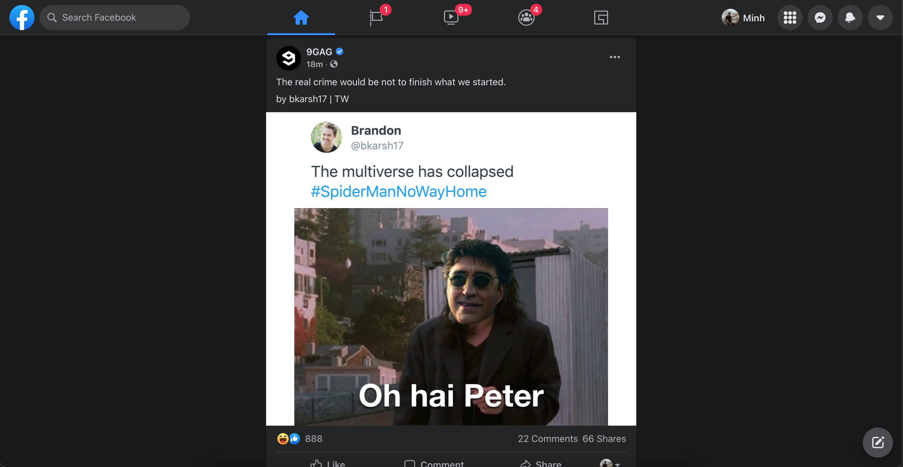

### Facebook Lite - Chrome Extension
Make your Facebook Cleaner

### Feature
* Remove Ads
* Clean Facebook (Remove element unused - make Facebook faster, no lagging anymore)

### How to use?

1. Download & Unzip [Facebook Lite](https://github.com/minhchienwikipedia/facebook-lite/releases/)
2. Open Chrome Extension: `chrome://extensions`
3. Chose `Load Unpacked` chose unzip folder of Facebook Lite
4. Open [Facebook](https://www.facebook.com/) to check how it work!

## License

This module is [MIT licensed](./LICENSE)

---